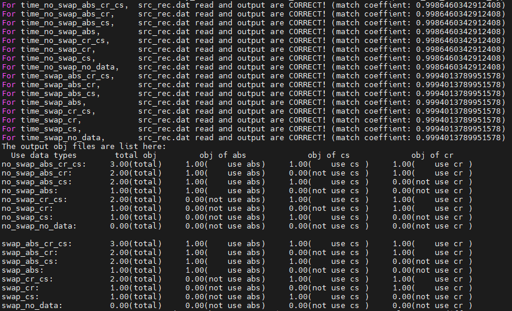

# Forward modeling test 

This is an example for checking whether the code can read different types of data when updating model parameters

1. Run all cells of `make_test_model.ipynb` or python script `make_test_mode.py` for creating necessary input files: 
    - source, receiver file (src_rec_obs.dat)
    - model with a mesh (model_N61_61_61.h5)


2. then run TOMOATT forward with `input_params/input_params_XXX.yml` for updating model using different types of data:
``` bash
mpirun --oversubscribe -n 2 ../../build/bin/TOMOATT -i input_params/input_params_no_swap_abs_cr_cs
```
The computed src_rec_file is saved as `OUTPUT_FILES/OUTPUT_FILES_no_swap_abs_cr_cs/src_rec_file_step0000.dat`.

3. compare the output src_rec_data and objectiove functions by running all cells of `compare_src_rec.ipynb` or python script `compare_src_rec.py`

You can run `bash run_this_example.sh` to proceed Step 1-3. Result is correct is you have the following output:




