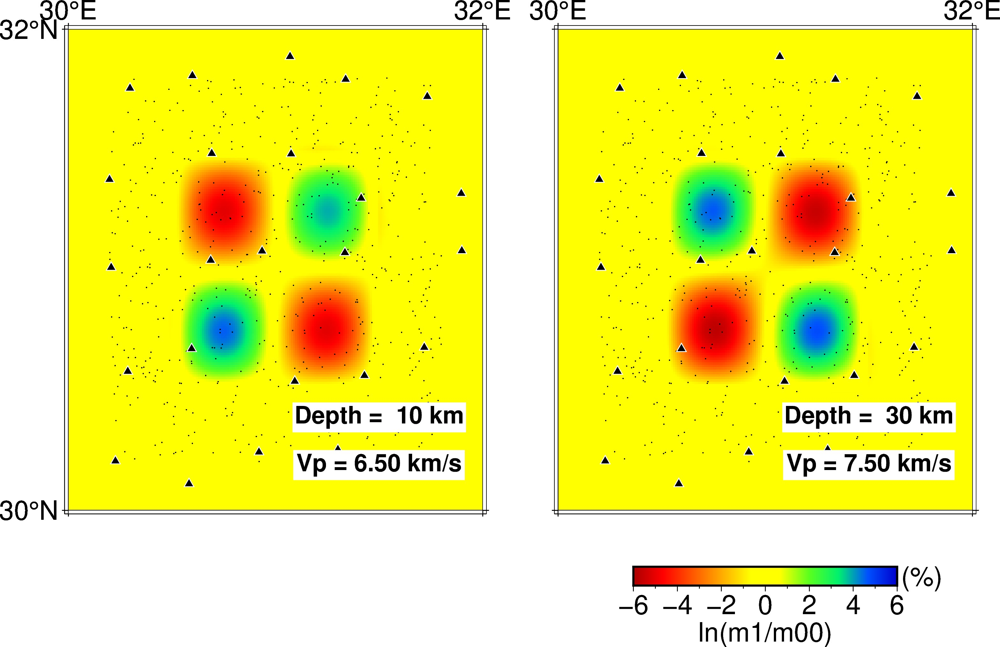
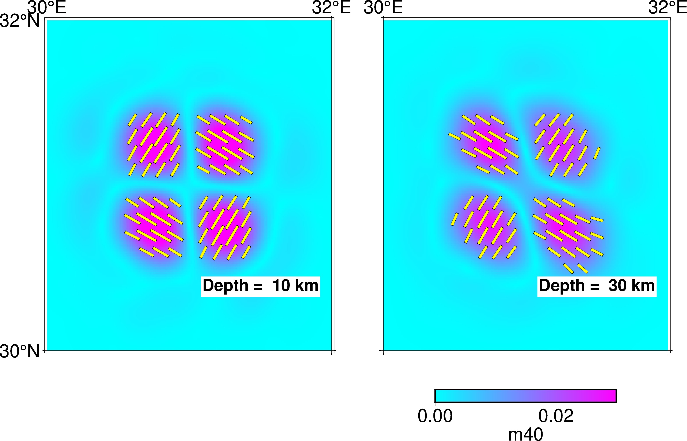

# checkerboard inversion test 

This is an example of checkerboard test to invert for Vp and anisotropy

1. this example use the model files and src_rec_file in `0_generate_files_for_TomoATT`
    - `0_generate_files_for_TomoATT/models/model_init_N61_61_61.h5`
    - `0_generate_files_for_TomoATT/models/model_ckb_N61_61_61.h5`
    - `0_generate_files_for_TomoATT/src_rec_files/src_rec_config.dat`

You can check the distribution of earthquakes (star) and stations (triangle) in `0_generate_files_for_TomoATT/img/src_rec.jpg`


2. then run TOMOATT forward with `input_params/input_params_signal.yml` to compute traveltime data in checkerboard model
``` bash
mpirun --oversubscribe -n 2 ../../build/bin/TOMOATT -i input_params/input_params_signal.yml
```
3. then run TOMOATT forward with `input_params/input_params_inv_abs.yml` to invert for Vp and anisotropy using absolute traveltime data from the initial model
``` bash
mpirun --oversubscribe -n 2 ../../build/bin/TOMOATT -i input_params/input_params_inv_abs.yml
```
3. finally, you can run `plot_ckb_model.ipynb` or `plot_ckb_model.py` to plot the checkerboard model 
``` bash
python  plot_ckb_model.py
```

The checkerboard model:




And run `plot_inversion_result.ipynb` or `plot_inversion_result.py` to plot the inversion result 




You can run `bash run_this_example.sh` to proceed Step 1-3.

The input parameters for using different types of data to perform the inversion are provided in input_params, e.g.,
    - using absolute traveltime, common receiver differential traveltime, and common source differential traveltime data: `input_params/input_params_inv_abs_cs_cr.yml`
    - using absolute traveltime and common receiver differential traveltime: `input_params/input_params_inv_abs_cr.yml`
    - using absolute traveltime and common source differential traveltime: `input_params/input_params_inv_abs_cs.yml`
    - ...
Users can apply different combination based their requirements.


