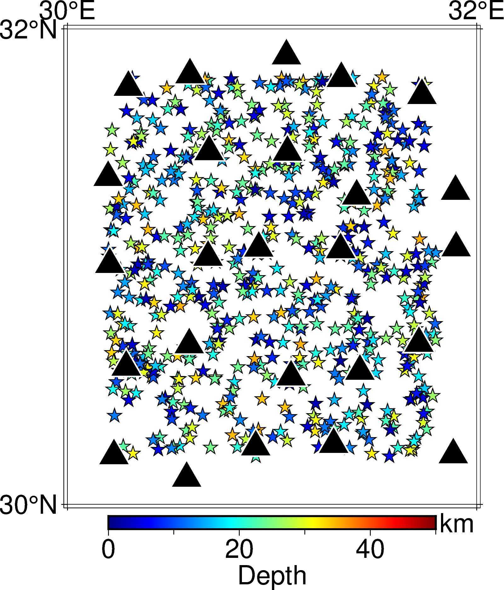
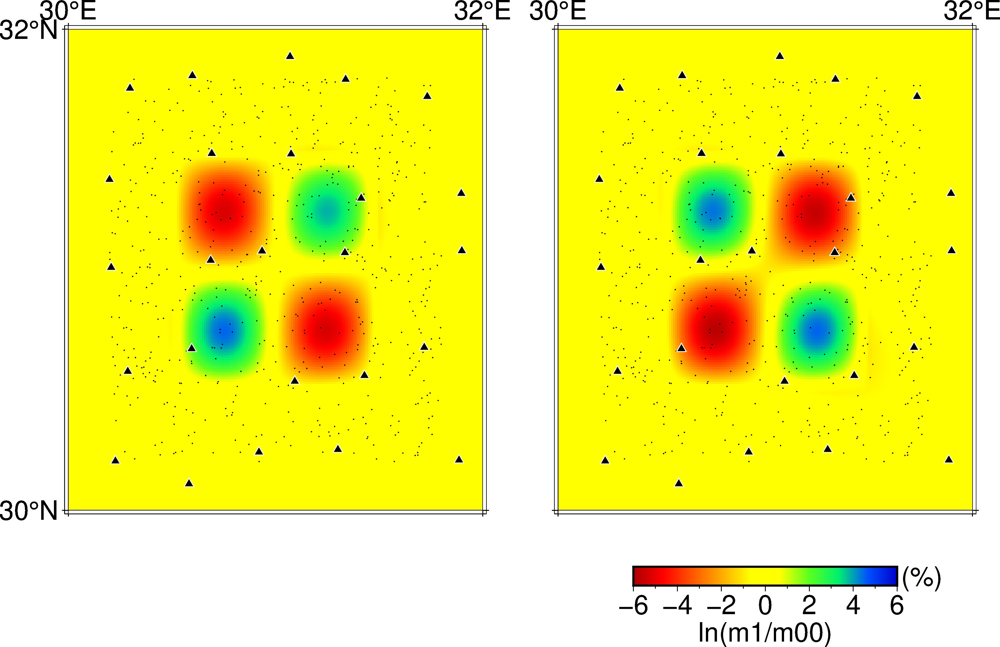
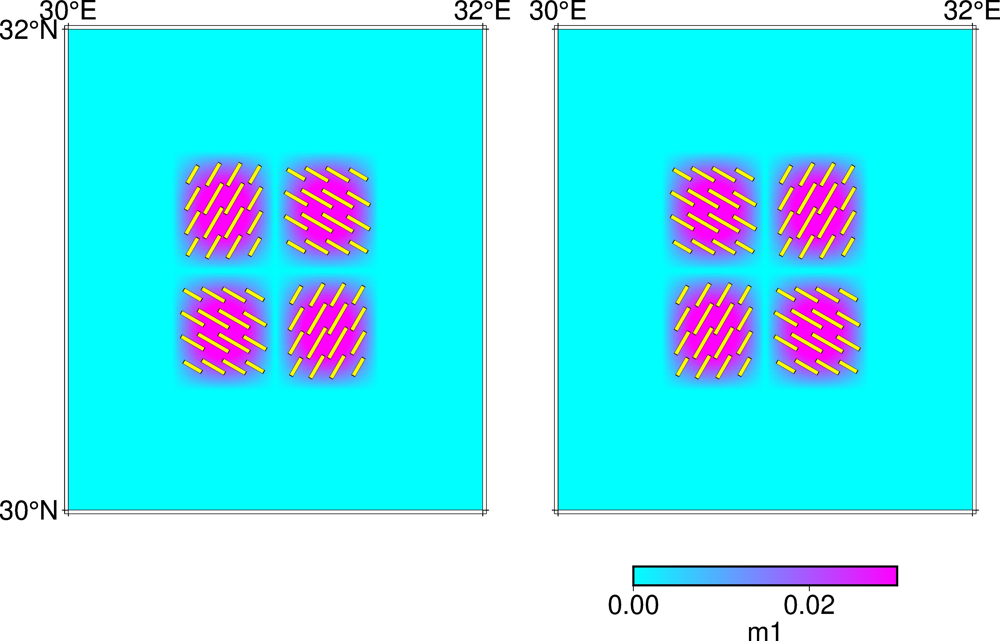
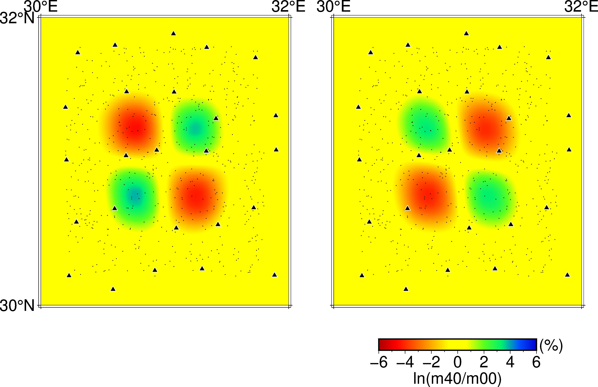
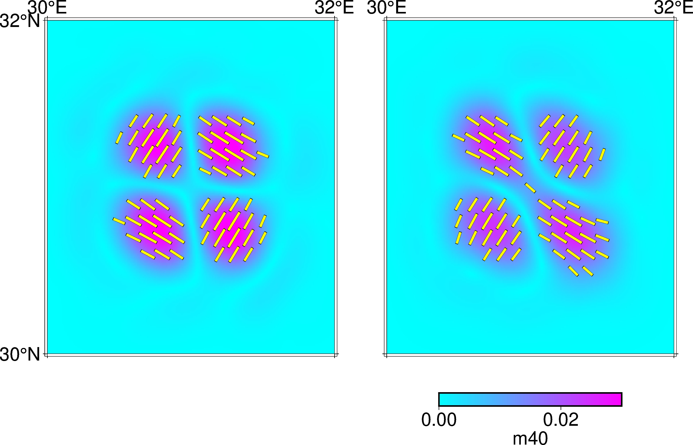

# Forward modeling test 

This is an example of checkerboard test to invert for Vp and anisotropy

1. Run all cells of `make_test_model.ipynb` or python script `make_test_mode.py` for creating necessary input files: 
    - source, receiver file (src_rec_config.dat)
    - model with a mesh (models/model_init_N61_61_61.h5 and models/model_ckb_N61_61_61.h5)

You can check the distribution of earthquakes (star) and stations (triangle) in img/src_rec.jpg



2. then run TOMOATT forward with `input_params/input_params_swap_signal.yml` to compute traveltime data in checkerboard model
``` bash
mpirun --oversubscribe -n 2 ../../build/bin/TOMOATT -i input_params/input_params_swap_signal.yml
```
3. then run TOMOATT forward with `input_params/input_params_swap_inv_abs.yml` to invert for Vp and anisotropy using absolute traveltime data
``` bash
mpirun --oversubscribe -n 2 ../../build/bin/TOMOATT -i input_params/input_params_swap_inv_abs.yml
```
3. finally, you can run `model_visualization.ipynb` or `model_visualization.py` to plot the checkerboard model and inversion result. 
``` bash
python  model_visualization.py
```

The checkerboard model:





And the inversion result:






You can run `bash run_this_example.sh` to proceed Step 1-3.


