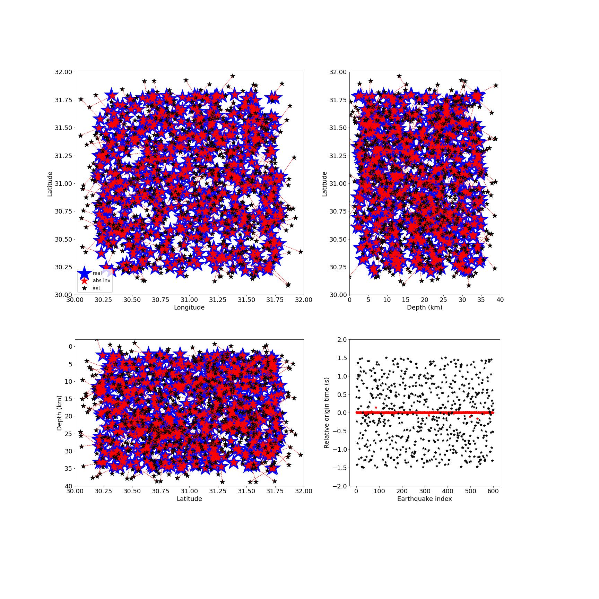

# relocation test 

This is an example to test earthquake location in the checkerboard model using absolute traveltime and common receiver differential traveltime data.

1. this example use the model file and src_rec_file in `0_generate_files_for_TomoATT`
    - `0_generate_files_for_TomoATT/models/model_ckb_N61_61_61.h5`
    - `0_generate_files_for_TomoATT/src_rec_files/src_rec_config.dat`

You can check the distribution of earthquakes (star) and stations (triangle) in `0_generate_files_for_TomoATT/img/src_rec.jpg`


2. then run TOMOATT forward with `input_params/input_params_signal.yml` to compute traveltime data in checkerboard model
``` bash
mpirun --oversubscribe -n 2 ../../build/bin/TOMOATT -i input_params/input_params_signal.yml
```
3. then run all cells of `generate_syn_obs_src_rec_data.ipynb` or python script `generate_syn_obs_src_rec_data.py` for deviate source location and origin time.
``` bash
python  generate_syn_obs_src_rec_data.py
```

4. then run TOMOATT forward with `input_params/input_params_reloc_XX.yml` to do relocation using different types of data
``` bash
mpirun --oversubscribe -n 2 ../../build/bin/TOMOATT -i input_params/input_params_reloc_abs.yml
```
``` bash
mpirun --oversubscribe -n 2 ../../build/bin/TOMOATT -i input_params/input_params_reloc_cr.yml
```
``` bash
mpirun --oversubscribe -n 2 ../../build/bin/TOMOATT -i input_params/input_params_reloc_abs_cr.yml
```

3. finally, you can run `compare_location_result.ipynb` or `compare_location_result.py` to evaluate the location quantitatively
``` bash
python  compare_location_result.py
```

and run `plot_location_result.ipynb` or `plot_location_result.py` show the location result in `img`:

location using absolute traveltime data:


location using common receiver traveltime data:


location using two types of data:



You can run `bash run_this_example.sh` to proceed all steps


