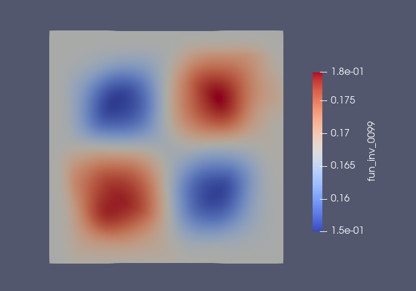

# Inversion test 

This is an example for inversion calculation with small grid.



1. Run all cells of `make_test_model.ipynb` or python script `make_test_mode.py` for creating necessary input files: 
    - source, receiver file (src_rec_test.dat)
    - true model (test_model_true.h5)
    - initial model (test_model_init.h5)

2. then run TOMOATT forward with `input_params_pre.yml` for calculating the true arrival times at the stations.
The calculated travel time at the stations is saved in the file `src_rec_test_out.dat`  
Following command will run the forward simulation with the true model
``` bash
mpirun -n 8 ../../build/TOMOATT -i input_params_pre.yml
```
The calculated data is saved in the file `OUTPUT_FILES/out_data_sim.h5`.
This file may be visualized by paraview with opening the index file `OUTPUT_FILES/out_data_sim.xmf`.
  
3. run TOMOATT in inversion mode with `input_params.yml`, by the command
``` bash
mpirun -n 8 ../../build/TOMOATT -i input_params.yml
```
The result data is again saved in the file `OUTPUT_FILES/out_data_sim.h5`.


4. Final result is saved in the file `OUTPUT_FILES/final_model.h5` as 3 dimensional arrays. `check_final_model.ipynb` shows how to read the final model and plot the result.
Other temporary results are stored in the file `OUTPUT_FILES/out_data_sim.h5` as 1 dimensional arrays subgrid based order.
For reconstructing those data into 3 dimensional array, user needs to run a post processing script.
Please refer the python script `data_post_process.py`.
